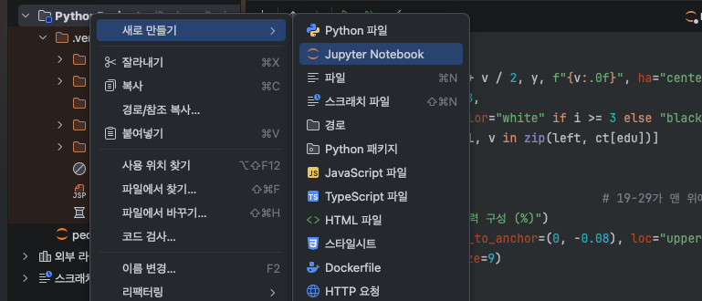
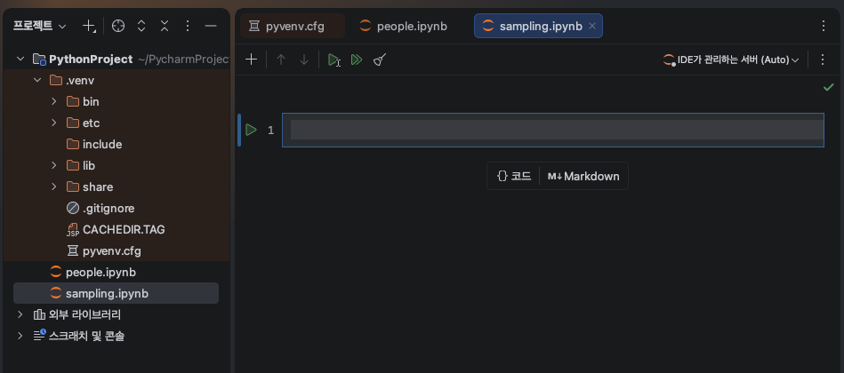
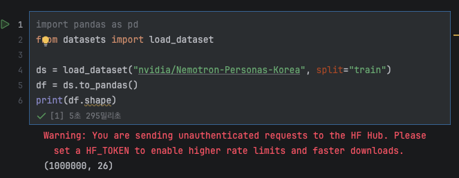
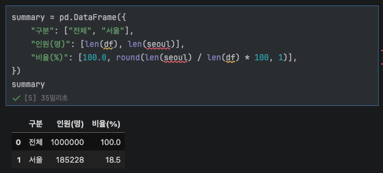
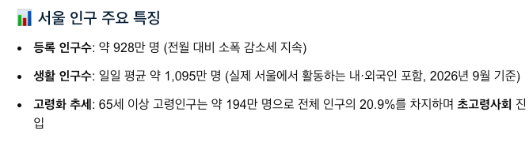
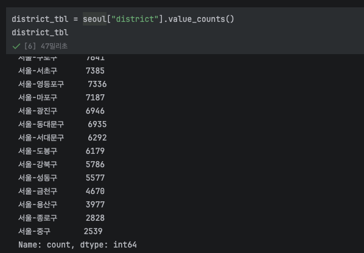
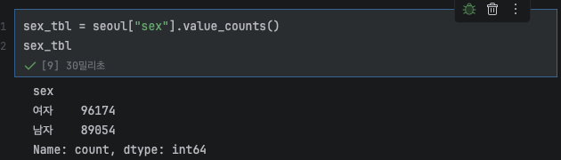
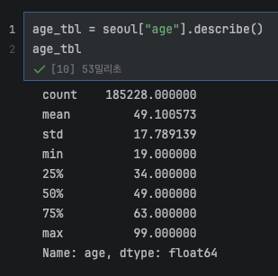

저번에는 데이터셋으로 EDA를 해보았어요.
오늘은 페르소나  100만 명 중에서 시뮬레이션에 쓸 
서울 시민 100명을 "누구를, 몇 명이나" 뽑을지 정하는 것입니다!
<br><br>
제 본가가 서울이 아닌데 왜 서울로 하냐고요? 작은 표본으로 전국을 대표하기는
힘들 것 같고 교통수단 비율은 지역마다 다르기 때문에 지역을 하나로 좁히는 것이 
합리적이라 생각했어요. 서울은 교통도 다양해 인구도 많아~ 자료도 많아~ 표본 설계하기 딱이겠죠?

## Step 1. 세팅
> ### 사용한 데이터
>https://huggingface.co/datasets/nvidia/Nemotron-Personas-Korea
> <br> 출처 : NVIDIA <br>
> https://kosis.kr/statHtml/statHtml.do?orgId=101&tblId=DT_1PM2001
> <br> 출처 : 통계청 KOSIS, 인구주택총조사
> <br><br>
> Nemotron-Personas-Korea 는 다 좋은데 19세 미만이 존재하지 않아요. 그래서 두번째 자료를 
> 이용해 보강하는 과정을 진행할거에요!


먼저 저번에 했던 프로젝트 창을 띄우고 새로운 주피터 노트북 만들어줄게요.
<br><br>

저는 이름을 sampling 이라 했어요. 그럼 이렇게 새로운 파일이 열립니다.
<br> 텅텅 비었죠? 저번에 고생해서 EDA 했던 데이터를 다시 불러와야 해요.
<br>

```python
import pandas as pd
from datasets import load_dataset

ds = load_dataset("nvidia/Nemotron-Personas-Korea", split="train")
df = ds.to_pandas()
print(df.shape) #표의 크기를 (행 수, 열 수)로 보여줌
```
코드 모르는거 집고 넘어가자면,
- Hugging Face에서 만든 datasets 라이브러리 안의 load_dataset이라는 함수만 가져오는 거예요. 이 
함수가 Hugging Face에 올라간 데이터셋을 인터넷에서 내려받아 줘요.
<BR>
- **nvidia/Nemotron-Personas-Korea**: 내려받을 데이터셋 이름이에요. "만든 곳/데이터셋 이름" 형식입니다.
- split="train": 데이터셋은 보통 train(학습용), test(평가용)처럼 나뉘어 있는데, 이 데이터셋은 100만 명 전체가 train에 들어 있어서 그걸 가져오라는 뜻이에요.


(1000000, 26)이 나오면 100만 명(행) × 26개 항목(열)이 잘 들어왔다는 뜻이에요.

---
## Step 2.페르소나에서 서울 거주자 추출
### 서울 후보군 추출
```python
seoul = df[df["province"].str.contains("서울")].copy()
summary = pd.DataFrame({
    "구분": ["전체", "서울"],
    "인원(명)": [len(df), len(seoul)],
    "비율(%)": [100.0, round(len(seoul) / len(df) * 100, 1)],
})
summary
```
> **코드 설명**
> <br>
> - str.contains("서울"): 각 줄의 시·도에 "서울" 글자가 있는지 True/False로 검사하고, df[ ]로 감싸면 True인 줄만 남아요. 
> - .copy(): 걸러낸 결과를 원본과 분리된 새 표로 저장해요.
> - **pd.DataFrame()** 은 pandas로 표를 새로 만드는 함수예요.
>만든 표는 summary 라는 이름에 저장하라는 겁나당. 
> - 괄호 안의 { }는 각각의 값이에요. "열 이름": [값들] 형태로 적으면, 열 이름이 표의 제목 칸이 되고
> 리스트 안의 값들이 위에서부터 차례로 칸에 들어가요.
> - **len()** 은 길이(개수)를 세라는 뜻!
> - 마지막의 summary는 print 없이도 격자 모양의 표로 보여줘요. 
> print(summary)로 하면 그냥 글자로 나와서 처음에 띠용 한답니다.

이걸로 서울 후보군의 기본 분포를 볼게요

오 18.5%가  나왔네요. 
{:.left}
구글에서 20.9%라는데 역시 비슷하게 나왔어요. 
<br> 이걸로 이제 서울 후보군의 기본 분포를 볼게요.<br><br>
### 구 별로 인원 구하기
```python
district_tbl = seoul["district"].value_counts()
district_tbl
```
>**코드 설명**
> - seoul["district"]: 서울 표에서 구(district) 열만 꺼내요. 
> - .value_counts(): 구마다 몇 명인지 세서 많은 순서로 정렬해요. 
> - 마지막 줄 district_tbl: 노트북에 표로 보여줘요.


가장 적은 구가 중구네요
<Br><br>
### 성별, 나이 인원 구하기
성별 인원 구하는 코드입니다!
```python
sex_tbl = seoul["sex"].value_counts() 
sex_tbl
```
구별 인원 구하기에서 썼던 코드랑 비슷합니다.

잘 나왔네요.
<br><br>다음은 나이 인원 구하는 코드에요.
```python
age_tbl = seoul["age"].describe()
age_tbl
```
{:.left}
**.describe()**: 개수(count), 평균(mean), 표준편차(std), 최솟값(min), 25%·50%·75% 위치값, 최댓값(max)을 한 번에 계산해요.
---
둘 다 잘 나왔어요. 결과를 정리하면 이래요.

- 성별 
  - 여자 96,174명(51.9%), 남자 89,054명(48.1%)
- 나이 
  - 최솟값(min) 19세  (2단계에서 12~18세를 보강해야 하는 이유) 
  - 평균 49.1세
  - 중앙 값(50%) 49세
  - 최댓값 99세
  25%가 34세, 75%가 63세
---
다음 2편에서는 **step.3 KOSIS로 서울 교통수단 비율구하기** 를 진행해볼게요!