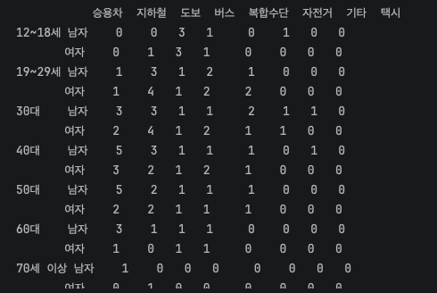

1편에서 서울 인구를 이용해 성별, 나이 등의 분포를 확인했죠? 
이번에는 서울 사람들이 통근, 통학할때 어떤 교통수단을 얼마나 쓰는지 비율을 구해
봅시다! 

--- 
## 1. 세팅
먼저 데이터 표본을 구하기 위해 KOSIS에서 파일을 받을게요.
링크는 1편에 있어요. 하지만 여기도 써줄게요...난 착하니까
<br>
[https://kosis.kr/statHtml/statHtml.do?orgId=101&tblId=DT_1PM2001](https://kosis.kr/statHtml/statHtml.do?orgId=101&tblId=DT_1PM2001)

검색에서 통학만 치면 **소요시간별_이용_교통수단별_통근_통학_인구_12세_이상_시군구**
라는 통계를 볼 수 있어요. 클릭하세요! 그러고 다운 하면 준비 완료.
<BR>
저는 파일 이름 편하게 kosis_commute 로 바꾸었어요.
<br>
<br>
{:.left}이렇게 프로젝트 폴더에 넣어주세요.

---

pandas는 CSV는 혼자 읽을 수 있지만, .xlsx 엑셀 파일은 openpyxl 설치해서 읽어야 해요.
바로 이 코드만 적어주면 됩니다.
```python
%pip install openpyxl
```

완료!
<br><br>
그리고 이 코드를 실행하여 노트북에서 불러옵니다.
```python
raw = pd.read_excel("kosis_commute.xlsx", header=1)

cols = ["행정구역별(시군구)", "통근·통학여부별"]
raw[cols] = raw[cols].ffill()

seoul_row = raw[(raw["행정구역별(시군구)"] == "서울특별시")
                & (raw["통근·통학여부별"] == "계")
                & (raw["소요시간별"] == "계")]
seoul_row
```
>**코드 설명** 
> - pd.read_excel("kosis_commute.xlsx", header=1): 엑셀 파일을 표로 읽어요. 이 파일은 맨 윗줄이 "2020"이고 진짜 열 이름(걸어서, 자전거 …)은 두 번째 줄에 있어요. 파이썬은 0부터 세기 때문에 header=1이 두 번째 줄을 열 이름으로 쓰라는 뜻이에요. 
> - cols = [...]: 자주 쓸 열 이름 두 개를 리스트로 묶어 둔 거예요.
> - .ffill(): "forward fill", 즉 빈칸을 바로 위 값으로 채우기예요. KOSIS 엑셀은 "서울특별시"를 첫 줄에만 적고 아래는 비워 두거든요. 이걸 채워야 어느 줄이 서울인지 컴퓨터가 알 수 있어요. 
> - raw[(조건1) & (조건2) & (조건3)]: 세 조건을 모두 만족하는 줄만 남겨요. &는 "그리고"라는 뜻이에요. 지역은 서울, 통근·통학은 계(둘 다 합친 것), 소요시간도 계(전체)인 줄 하나만 뽑는 거예요.


이렇게 표로 뜨네요. 성공입니당
---

## Step 2. 교통수단 표본 뽑기
통계청에서는 송파구에서의 통근 통학 인구를 교통수단별로 제공해주더라구요. 이걸 
이용해 표본을 뽑아보도록 합시다!
> 통계청 링크
> <br>
> [국가데이터처,「인구총조사」, 2020, 2026.10.05, 소요시간별/이용 교통수단별 통근 통학 인구(12세 이상)-시군구](https://kosis.kr/statHtml/statHtml.do?orgId=101&tblId=DT_1PA2004&conn_path=I2)

 
{:.pair}

왼쪽사진은 조회설정으로 송파구의 정보만 볼 수 있게 제가 조정하는 사진이고
<br> 오른쪽은 엑셀 내용중 하나에요 
다운받은 파일은 **'kosis_songpa'**로 바꾸었습니다.
```python
def load_kosis(path):
    raw = pd.read_excel(path, header=1)
    cols = ["행정구역별(시군구)", "통근·통학여부별"]
    raw[cols] = raw[cols].ffill()
    raw["행정구역별(시군구)"] = raw["행정구역별(시군구)"].str.strip()
    return raw

def pick_row(raw, region, kind="계"):
    return raw[(raw["행정구역별(시군구)"] == region)
               & (raw["통근·통학여부별"] == kind)
               & (raw["소요시간별"] == "계")].iloc[0]

songpa_raw = load_kosis("kosis_songpa.xlsx")
```
 
> **코드 설명**
> -  **def load_kosis(path):** 는 "load_kosis라는 함수를 만들겠다"는 뜻이에요. 함수는 자주 쓰는 코드를 묶어둔 상자예요.
> 괄호 안의 **path** 자리에 파일 이름을 넣으면 안쪽 코드가 그 파일로 실행돼요.
> - **pd.read_excel(path, header=1)** 은 엑셀을 표로 읽어요. 진짜 열 이름이 두 번째 줄에 있어서 header=1 이에요. (파이썬은 0부터 세요!)
> - **str.strip()** 은 글자 앞뒤 빈칸을 지워요. 송파구 파일은 이름 앞에 안 보이는 공백이 붙어 있어서(`\u{3000}\u{3000}\u{3000}송파구`) 이걸 안 하면 못 찾아요.
> - **return raw** 는 정리된 표를 함수 밖으로 돌려준다는 뜻이에요.
> - **pick_row(raw, region, kind="계")** 는 지역 이름과 통근·통학 구분을 넣으면 그 줄 하나를 골라주는 함수예요.
> **kind="계"** 처럼 = 뒤에 값을 적어두면 기본값이 돼서, 따로 안 넣으면 "계"(통근 + 통학)를 골라요.
> - **&** 는 "그리고", **.iloc[0]** 은 골라낸 것 중 첫 번째 줄이에요.

> 💡 처음 실행했을 때 **ModuleNotFoundError** 가 떴어요. pandas는 엑셀을 읽을 때 **openpyxl** 이라는 도구가 따로 필요하대요.
> <br> 새 셀에 `%pip install openpyxl` 을 실행하고 다시 돌리니 해결!
> 

{:.left} 실행하면 교통수단별로 합계가 나와요!

---


<br><br>여기서 교통수단은 12개이지만 8개로 저는 묶어 계산했습니다. 이렇게요.

| 시뮬레이션 범주 |	포함한 KOSIS 항목 |
|---|---|
| 승용차 |승용차·승합차|
| 지하철	|전철·지하철|
| 도보 |걸어서|
| 버스	 |시내·좌석·마을버스 + 통근·통학차량 + 고속·시외버스|
| 환승하는 사람	 |복합수단|
| 자전거	 |자전거|
| 기타	 |트럭 + 기차 + 기타|
| 택시	 |택시|

버스를 굳이 마을버스와 고속.시외버스 그리고 통근 통학차량으로 나누기 보다는 하나로
합치는게 더 깔끔하다고 생각했어요. 그리고 트럭, 기차, 기타는 상대적으로 
인원수가 적어서 하나로 합했습니다. 
<br><Br>그리고 택시를 따로 뺀 이유는 택시로 
정기적으로 통근하는 사람은 없다고 생각했기 때문이에요.
기차와 트럭, 기타는 주기적으로 이용하는 사람이 있다고 생각하지만
택시는 주기적인 이용을 하는 사람이 적다 생각해서 따로 기타에 넣지 않고 별도로
넣었습니다. <br><Br>

복합수단은 버스 타고 지하철로 갈아타는 것처럼 서로 다른 수단이라고 한대요. 처음에는 이걸
버스와 지하철로 나눠보려고 했는데, 원자료에 무엇을 섞었는지가 명확하지 않아
근거 약한 가정을 넣는것 보다는 그냥 하나의 수단으로 두는게 낫다고 판단하여
"환승하는 사람"으로 다루기로 정했습니다.

### 그렇게 다시 8개로 교통수단별 합계를 구해볼게요.


{:.left}
```
modes = ["걸어서", "자전거", "승용차,승합차(벤)", "트럭", "시내,좌석,마을버스",
         "통근,통학차량", "고속,시외버스", "전철,지하철", "기차", "택시", "기타", "복합수단"]

def make_counts(row):
    m = row[modes].replace("-", 0).astype(int)
    return pd.Series({
        "승용차": m["승용차,승합차(벤)"],
        "지하철": m["전철,지하철"],
        "도보": m["걸어서"],
        "버스": m["시내,좌석,마을버스"] + m["통근,통학차량"] + m["고속,시외버스"],
        "복합수단": m["복합수단"],
        "자전거": m["자전거"],
        "기타": m["트럭"] + m["기차"] + m["기타"],
        "택시": m["택시"],
    })

seoul_counts = make_counts(seoul_row)
songpa_counts = make_counts(songpa_row)

song_traffic = pd.DataFrame({
    "송파구(%)": (songpa_counts / songpa_counts.sum() * 100).round(1),
})
print(song_traffic)
```
---

이제 거의 다왔네요

### 송파구 페르소나 후보
EDA에서 다루었던 페르소나 데이터에 송파구 사람이 충분히 있는지도 확인해보려고 합니다.
<br>
EDA편에서 다루었던 주피터 노트북을 그대로 이용할게요

> **코드 설명**
> - df["district"] == "서울-송파구": 구 이름이 "서울-송파구"인지 줄마다 True/False로 검사해요.
> - df[ ... ]: True인 줄만 남겨서 송파구 사람만 걸러요. 구 이름에 이미 "서울-"이 붙어 있으니 서울을 먼저 고를 필요가 없어요. 
> - .copy(): 원본과 분리된 새 표로 저장해요.

와우 12479명이라니 많네요 그럼 성별 분포도 적당한지 확인하고 마지막 나이와 성별 고려해서 100명 정하기 단계로
넘어가볼까요?

100으로 추리기에 아주 표본이 넘쳐나네요! 바로 다음 단계로 진행시켜!!
## Step 3. 나이 x 성별 고려해서 최종 100명 선정

### 교통수단에서 100명 분배
아까 서울의 통근 교통수단 비율을 구해봤잖아요?
그걸 이용하여 
<br>
**송파구 100명 = 지하철 33, 승용차 27, 버스 19, 도보 16, 자전거 3, 기타 2, 택시 0**
으로 정했습니다!

### 나이, 성별에서의 분배
> 딱 맞는 표를 찾았어요<br> 
> [송파구 교통수단 나이, 성별 분포](https://kosis.kr/statHtml/statHtml.do?orgId=101&tblId=DT_1PA2003&conn_path=I2)


처음에는 교통수단 표와 성별·나이대 표를 따로 구해서 "나이대와 상관없이 교통수단 비율이 같다"고 가정하고 합치려고 했어요. <br> 그런데 KOSIS를 더 뒤져보니 세 기준을 한꺼번에 센 표가 있었어요!
<br> 하하ㅏ하ㅏㅎ하핳
<br>이 파일 이름은 "kosis_songpa_joint"로 했습니다.
### 최대잉여법 함수

비율 × 100을 하면 소수점이 생기는데, 그냥 반올림하면 합계가 99명이나 101명이 될 수 있어요. <br> 그래서 최대잉여법을 썼어요. 정수 부분만큼 먼저 나눠주고, 모자란 인원은 소수점이 큰 순서대로 1명씩 더 주는 방법이에요.

```python
def allocate(counts, N):
    raw_n = counts / counts.sum() * N
    alloc = raw_n.astype(int)
    remain = N - alloc.sum()
    top = (raw_n - alloc).sort_values(ascending=False).index[:remain]
    alloc[top] += 1
    return alloc
```
> 코드 설명 <br>
> - raw_n 은 비율 × N. 예를 들어 승용차는 27.21이 나와요. 
> - astype(int) 는 소수점을 그냥 버려요. 27.21 → 27. 이렇게 하면 합계가 N보다 모자라요. 
> - remain 은 남은 인원, (raw_n - alloc) 은 버려진 소수점 부분이에요. 
> - sort_values(ascending=False) 로 소수점이 큰 순서로 세우고, .index[:remain] 으로 앞에서 남은 인원 수만큼 골라요. 
> - alloc[top] += 1 로 그 칸들에 1명씩 더해줘요.

### 성별 × 나이대 × 교통수단 표 만들기

KOSIS 표는 5세 단위라 15~19세가 한 묶음이에요. 페르소나는 19세부터 있어서 18세와 19세 사이를 잘라야 해요. <br> 그래서
[교육정도 표](https://kosis.kr/statHtml/statHtml.do?orgId=101&tblId=DT_1PM2001&conn_path=I2)의 1세 단위 인구로, 15~19세 중 19세가 차지하는 비율을 구해서 나눴어요.


|성별	|15~19세 인구	|19세 인구	|19세 비율|
|---|---|---|---|
|남자|	14,553	|3,028	|20.8%|
|여자	|13,802|	3,165	|22.9%|

```python
joint_raw = pd.read_excel("kosis_songpa_joint.xlsx", header=1)
joint_raw[["성별", "연령별"]] = joint_raw[["성별", "연령별"]].ffill()
joint_raw["연령별"] = joint_raw["연령별"].str.strip()

by = joint_raw.apply(make_counts, axis=1)
by[["성별", "연령별"]] = joint_raw[["성별", "연령별"]]
by = by.groupby(["성별", "연령별"]).sum()

ratio_19 = {"남자": 3028 / 14553, "여자": 3165 / 13802}
ages = ["12~18세", "19~29세", "30대", "40대", "50대", "60대", "70세 이상"]

rows = {}
for sex in ["남자", "여자"]:
    r = ratio_19[sex]
    s = lambda age: by.loc[(sex, age)]
    rows[("12~18세", sex)] = s("12~14세") + s("15~19세") * (1 - r)
    rows[("19~29세", sex)] = s("15~19세") * r + s("20~24세") + s("25~29세")
    rows[("30대", sex)] = s("30~34세") + s("35~39세")
    rows[("40대", sex)] = s("40~44세") + s("45~49세")
    rows[("50대", sex)] = s("50~54세") + s("55~59세")
    rows[("60대", sex)] = s("60~64세") + s("65~69세")
    rows[("70세 이상", sex)] = s("70~74세") + s("75세 이상")

joint = pd.DataFrame(rows).T
joint = joint.loc[[(age, sex) for age in ages for sex in ["남자", "여자"]]]
joint.round().astype(int)
```
> **코드 설명 <br>**
> - 파일을 읽고 ffill() 로 성별·나이대 빈칸을 채우고, str.strip() 으로 나이대 앞 공백을 지워요.
> - joint_raw.apply(make_counts, axis=1) : 아까 만든 make_counts 함수를 한 줄씩 적용해요. 12개 교통수단이 8개 범주로 묶여요. 함수 재활용!
> - groupby(["성별", "연령별"]).sum() : 성별·나이대가 같은 줄끼리 더해요. 표에는 통근 줄과 통학 줄이 따로 있어서, 이걸로 둘을 합쳐요. 
> - ratio_19 는 15~19세 중 19세의 비율이에요. 위 표의 숫자로 계산했어요 
> - s = lambda age: by.loc[(sex, age)] : "나이대를 넣으면 그 성별·나이대 줄을 꺼내주는" 짧은 함수예요. by.loc[(sex, age)] 를 매번 길게 쓰기 싫어서 만들었어요. 
> - rows[("30대", sex)] : 는 5세 단위 두 개를 합쳐 10세 단위로 만들어요. 12~18세는 "12~14세 + 15~19세 중 19세를 뺀 부분", 19~29세는 "15~19세 중 19세 부분 + 20대"예요. 
> - pd.DataFrame(rows).T 로 표를 만들고(.T 는 가로세로를 뒤집기), .loc[[...]] 로 나이대 순서대로 남자·여자를 번갈아 정렬해요.


**나이대마다 교통수단이 확실히 달라요.**

청소년은 절반 넘게 걸어서 다녀요. 학교가 집 근처라서겠죠? 남학생은 자전거도 꽤 타요.<br>
20대와 30대 여자는 지하철이 1등이에요. 20대 여자는 40%가 지하철!<br>
40~50대 남자는 승용차가 압도적이에요. 거의 둘 중 한 명이 승용차예요.<br>
나이대와 상관없이 같은 비율로 나눴다면 이런 차이를 모르고 구할뻔 했네요 휴~~

### 성별·나이대 인원, 교통수단 인원 정하기

위 표를 가로로 더하면 성별·나이대별 인원, 세로로 더하면 교통수단별 인원이 나와요. 각각 100명으로 나눴어요.

```python
row_target = allocate(joint.sum(axis=1), 100)
col_target = allocate(joint.sum(axis=0), 100)
row_target, col_target
```
> **코드 설명 <br>**
> - joint.sum(axis=1) 은 가로 방향으로 더해서 성별·나이대별 통근·통학자 수를 구해요. axis=0 은 세로 방향이라 교통수단별 인원이에요.
> - allocate(..., 100) 으로 각각 100명을 나눠요.

  
{:.pair}

청소년은 10명이에요. 페르소나에 없는 나이라 Step 4 에서 합성할 거예요.<br>
70세 이상은 2명뿐이에요. 송파구 70세 이상 주민 약 5만 4천 명 중 통근·통학하는 사람은 13% 정도거든요. <br> 전체 주민이 아니라 통근·통학자 기준 표를 쓴 덕분에 이게 반영됐어요.


### 성별과 나이 고려해서 교통수단 한명한명 정하기

이제 아까 나이대 성별로 상세히 인원을 구했던 표(성별 × 나이대 × 교통수단 표)를 
100명 규모로 줄이면 돼요. 표 전체를 376,433명으로 나누고
100을 곱하면 "승용차 타는 40대 남자 5.16명"처럼 당연히 소수점이 나오더라구요.
<br> 이걸 정수로 바꿀 때 지켜야 할 조건이 두 개예요.
<br><br>

가로 합계 = ②번에서 정한 성별·나이대 인원 (40대 남자는 꼭 12명)
<br>
세로 합계 = ②번에서 정한 교통수단 인원 (승용차는 꼭 27명)
<br><br>
그냥 반올림하면 두 합계가 안 맞아서, 두 합계를 지키면서 원래 소수점 값과
가장 가깝게 정수를 고르는 최적화를 했어요.
<br> 이때 오차를 집단 크기로 나눠서 계산했어요. 
1명뿐인 70세 이상에게는 1명 차이가 아주 크기 때문에,
작은 집단일수록 자기 집단에서 가장 흔한 수단을 받게 되겠죠?
<br> (처음에 그냥 했더니 70세 이상 여자가 확률 1%짜리 "기타"로 배정되는 일이 생겨서 이렇게 고쳤어요.)
<br><br>
```python
import numpy as np
from scipy.optimize import linprog

def round_table(exp, row_target, col_target):
    base = np.floor(exp).astype(int)
    frac = (exp - base).values
    row_left = (row_target - base.sum(axis=1)).values
    col_left = (col_target - base.sum(axis=0)).values
    n_r, n_c = frac.shape

    A_eq, b_eq = [], []
    for i in range(n_r):
        a = np.zeros(n_r * n_c)
        a[i * n_c:(i + 1) * n_c] = 1
        A_eq.append(a)
        b_eq.append(row_left[i])
    for j in range(n_c):
        a = np.zeros(n_r * n_c)
        a[j::n_c] = 1
        A_eq.append(a)
        b_eq.append(col_left[j])

    w = row_target.values.reshape(-1, 1)
    res = linprog(-((2 * frac - 1) / w).ravel(), A_eq=A_eq, b_eq=b_eq, bounds=(0, 1))
    plus = np.round(res.x).astype(int).reshape(n_r, n_c)
    return base + plus

exp = joint / joint.values.sum() * 100
cross = round_table(exp, row_target, col_target)
print(cross)
```
> **코드 설명 <br>**
> - import numpy as np 는 숫자 계산 도구, from scipy.optimize import linprog 는 최적화 도구예요. 
>   - scipy가 없다고 나와서 %pip install scipy 를 실행했어요. 그러면 해결됩니당 
> - exp = joint / 전체 × 100 은 표를 100명 규모로 줄인 소수점 표예요. 
> - round_table 은 소수점 표를 받아서 가로·세로 합계를 지키는 정수 표로 바꾸는 함수예요. 
>   - base = np.floor(exp) 로 일단 소수점을 다 버려요. 5.16 → 5 
>   - frac 은 버린 소수점 부분, row_left / col_left 는 가로·세로 합계를 맞추려면 아직 더 줘야 하는 인원이에요. 
>   - A_eq, b_eq 는 "가로로 더하면 row_left, 세로로 더하면 col_left가 돼야 한다"는 조건을 컴퓨터가 알아듣는 모양으로 적은 거예요. 
>   - linprog(...) 는 그 조건을 지키면서 +1을 줄 칸을 골라줘요. 소수점이 큰 칸일수록, 작은 집단일수록 먼저 +1을 받아요. bounds=(0, 1) 은 칸마다 최대 1명만 더 준다는 뜻이에요. 
>   - base + plus 로 버렸던 표에 +1을 더해서 최종 정수 표를 돌려줘요.





가로 합계는 성별·나이대 인원과, 세로 합계는 교통수단 인원과 정확히 같아요. 
<br> 그리고 위의 표의 특징이 그대로 살아 있어요. 
청소년 10명 중 6명이 도보, 40·50대 남자 22명 중 10명이 승용차, 
20대 여자 10명 중 4명이 지하철이에요.
<br><br>
사진으로는 너무 정리 안된 모습이니 표로 보여드릴게요.


### **마지막!! 100명 명단 만들기**

마지막으로 위 표를 한 줄에 한 명씩 펼쳐서 명단을 만들었어요.
<br>(택시는 0명이라 표에서 뺐어요.)

|나이대·성별|	승용차	|지하철|	도보	|버스	|복합수단|	자전거|	기타	|계|
|---|-|-|---|---|----|---|---|---|
|12~18세 남자|	0	|0|3|	1|	0|	1|	0|	5|
|12~18세 여자	|0	|1|	3|	1|	0|	0|	0|	5|
|19~29세 남자	|1	|3|	1|	2|	1|	0|	0|	8|
|19~29세 여자	|1	|4|	1|	2|	2|	0|	0|	10|
|30대 남자	|3	|3|	1|	1|	2|	1|	1|	12|
|30대 여자	|2	|4|	1|	2|	1|	1|	0|	11|
|40대 남자	|5	|3|	1|	1|	1|	0|	1|	12|
|40대 여자	|3	|2|	1|	2|	1|	0|	0|	9|
|50대 남자	|5	|2|	1|	1|	1|	0|	0|	10|
|50대 여자	|2	|2|	1|	1|	1|	0|	0|	7|
|60대 남자	|3	|1|	1|	1|	0|	0|	0|	6|
|60대 여자	|1	|0|	1|	1|	0|	0|	0|	3|
|70세 이상 남자|1|	0|	0	|0|	0|	0|	0|	1|
|70세 이상 여자	|0|	1|	0	|0|	0|	0|	0|	1|
|계	|27	|26|	16|	16|	10|	3|	2	|100|

일단 이걸 바탕으로 페르소나에서 성인 90명을 추출하고 그리고 10명의 청소년
데이터를 만들어 합칠거에요.
```python
people = []
for (age, sex), row in cross.iterrows():
    for mode, n in row.items():
        for _ in range(n):
            people.append({"나이대": age, "성별": sex, "교통수단": mode,
                           "출처": "합성" if age == "12~18세" else "페르소나"})

people = pd.DataFrame(people)
people.index = range(1, len(people) + 1)
people.index.name = "번호"
people.to_csv("songpa_100.csv", encoding="utf-8-sig")
people.head(10)
```
> **코드 설명 <br>**
> - people = [] 는 빈 리스트예요. 여기에 한 명씩 채워 넣을 거예요. 
> - cross.iterrows() 는 표를 한 줄씩 꺼내요. (age, sex) 는 ("40대", "남자") 같은 줄 이름, row 는 그 줄의 교통수단별 인원이에요. 
> - for _ in range(n): 은 n번 반복해요. 승용차가 5명이면 승용차 탄 사람을 5번 추가해요. _ 는 "반복 횟수만 필요하고 값은 안 쓴다"는 뜻이에요.
> - "합성" if age == "12~18세" else "페르소나" 는 청소년이면 "합성", 아니면 "페르소나"라고 적어요. 
> - people.index = range(1, ...) 로 번호를 1번부터 매기고, to_csv(...) 로 파일로 저장해요. utf-8-sig 는 엑셀에서 열어도 한글이 안 깨지게 해요.


이렇게 프로젝 폴더 안에 엑셀 파일이 생기고 정보가 입력된걸 볼 수 있어요!
이제 이 명단의 "페르소나" 90명 자리에 같은 나이대·성별의 송파구 페르소나를 한 명씩 뽑아 넣고, "합성" 10명은 새로 만들면 시뮬레이션 주민 명단이 완성돼요!

--- 
## 요약
이 페이지에서 한걸 정리해볼게요.
송파구 시뮬레이션 주민 100명은 이렇게 구성돼요.

|기준|	배분|
|---|---|
|교통수단|	승용차 27, 지하철 26, 도보 16, 버스 16, 복합수단 10, 자전거 3, 기타 2, 택시 0|
|성별	|남자 54, 여자 46|
|나이대|	12~18세 10, 19~29세 18, 30대 23, 40대 21, 50대 17, 60대 9, 70세 이상 2|
|한 명 단위	|교통수단 × 성별 × 나이대 교차표 → 100명 명단 (songpa_100.csv)|
|뽑는 곳	|성인 90명은 페르소나, 청소년 10명은 합성|

### 고민정
1. 15~19세 중 19세를 구하기 위해 통근 통학자가 아닌 송파구 19세 인구수를 사용했어요.
2. 통근 통학만 반영하게됬어요. 보통 놀러가거나 장보기, 외식 등 그런 이동은 제외되었네요.
<br><br>
다음 글에서는 이 고민점을 다루어보고 성인 90명을 페르소나에서 뽑고, 청소년 10명을 합성해 볼게요!
---
**참고 자료**
<br>nvidia/Nemotron-Personas-Korea (Hugging Face)
<br>KOSIS 소요시간별/이용 교통수단별 통근 통학 인구(12세 이상)-시군구 (DT_1PA2004)
<br>KOSIS 성별/연령별/이용 교통 수단별 통근 통학 인구(12세 이상)-시군구 (DT_1PA2003)
<br>KOSIS 성, 연령 및 교육정도, 교육상태별 인구(6세이상, 내국인)-시군구 (DT_1PM2001)